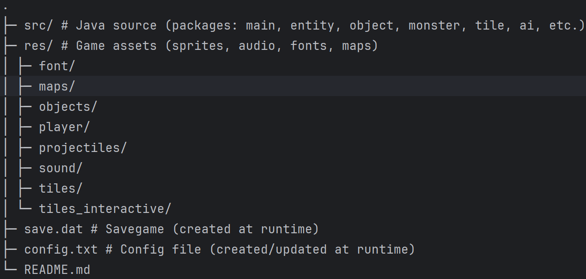

# Pixel Adventure Quest

**Author:** Ali Ansari  
**Student ID:** 13800680  
**Programme:** MSc Computer Science 2025 Project  
**Repository:** https://github.com/badnan5410/MSc-CS-Final-Project-2025.git

---

## Overview

A top-down 2D action RPG inspired by classics like *The Legend of Zelda*, with familiar crafting/utility vibes from *Minecraft*. Explore an overworld, delve into a dungeon, trade in a shop, and defeat the boss lurking beneath the island to claim a legendary treasure.

---

## Features

- **Maps:** Overworld, Shop (interior), Dungeon (two floors), Boss room
- **Combat:** Melee, guarding/parry, ranged magic (projectiles)
- **AI:** Pathfinding, aggro detection, line-of-sight attacks, day/night stat scaling
- **Trading:** Buy and sell items with an NPC merchant
- **Classes:** Choose **Fighter**, **Magician**, or **Thief**—each with unique benefits
- **Day/Night:** Darkness filter; monsters buff at night; tents skip to morning; lanterns provide light
- **Persistence:** Save/load game state; basic runtime configuration

---

## Requirements

- **OS:** Windows 11 (primary development target)
- **JDK:**
    - **Recommended:** Java 17 (LTS) or Java 21 (LTS)
    - **Tested on:** Java 24.0.1 (HotSpot) on Windows 11
    - If building with JDK 24 or newer, compile for a lower target for compatibility:

---

## Project Structure

> **Classpath note:** The code loads assets via `getResourceAsStream("/...")`. Ensure `res/` is on the runtime classpath (or packaged into the JAR).

---

## Build & Run

### Option A: IntelliJ IDEA (recommended for quick start)
1. **Open** the project folder in IntelliJ.
2. In the Project tool window:
    - Right-click `src/` → **Mark Directory as → Sources Root**.
    - Right-click `res/` → **Mark Directory as → Resources Root** (or Sources Root if Resources Root isn’t available).
3. Create a **Run Configuration** with:
    - **Main class:** `main.Main`
    - **Working directory:** project root
    - **Use classpath of module:** the module that contains `src` and `res`.
4. **Run** the configuration.

---

Controls

- Move character/cursor: W A S D

- Attack / Interact / Select: Enter

- Block / Guard: Space

- Shoot: F

- Inventory: C

- Pause: P

- Settings: Esc

- Full Map: M

- Mini-map toggle: X

- Debug overlay: T

- God mode toggle: G

---

Gameplay Notes

- Classes

    - Fighter: More HP and Strength; strong melee.

    - Magician: More MP and stronger/faster projectiles.

    - Thief: Faster movement, extra coins, higher Dexterity.

- Economy: Earn coins from drops and chests; trade with the Merchant.

- Lighting: Lantern increases visible radius; tents skip to morning and fully restore HP/MP.

- Monsters: Change behavior based on proximity and time of day; some shoot projectiles.

- Boss: “Umberos, Skeleton King” in the lower dungeon. Enrages at half health.Classes

---

Save/Load & Config

- Save file: save.dat in the project root.

- Config file: config.txt in the project root.

- Advice: Avoid manual edits—hand-editing risks corrupting game state.

---

Assets & Credits

- Font: MaruMonica.ttf — https://www.freejapanesefont.com/marumonica-font-download/

- Sprites: Original designs created in Piskel.

- Audio/Music: Sourced from Pixabay — https://pixabay.com/

- Ensure your use complies with the respective licenses for the assets.

---

Known Issues / Tips

- Fullscreen: Minor drawing/lag issues can occur. Prefer windowed mode for smoother play.

- Audio mix: Suggested starting point — Music 2/5, SFX 4/5.

- Classpath: If assets fail to load, confirm res/ is on the classpath (or included in the JAR).

- JDK mismatch: If building with a newer JDK, compile with --release 17 for compatibility.

---

Troubleshooting

- Black screen or missing textures/sounds

    - Ensure res/ is on the runtime classpath (see Build & Run).

- Game won’t start from IntelliJ

    - Verify src/ is Sources Root and res/ is Resources Root.

    - Check Run Configuration main class: main.Main.

- Unexpected crashes after editing files

    - Revert changes to save.dat / config.txt. Delete them to regenerate if necessary.